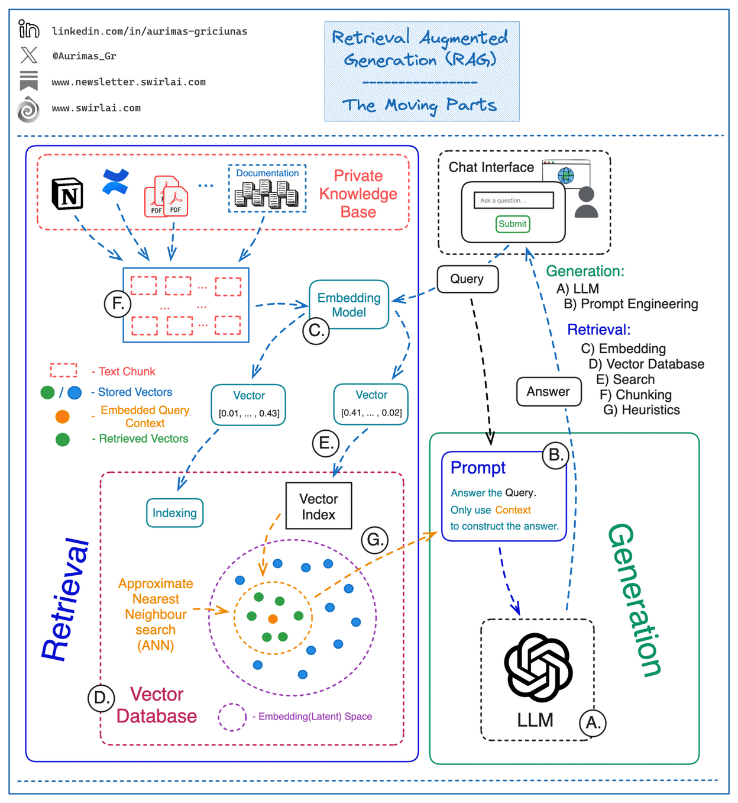

# Vietnamese-History-and-Culture-Chatbot

# System pipeline 

# Achieved
- Developed a chatbot using ChatGPT API and LangChain for answering queries about Vietnamese
history and culture.
- Implemented RAG techniques with Qdrant as a vector database to enhance retrieval accuracy.
- Built an interactive web application with Streamlit and integrated Streamlit history into
- LangChain.
- Deployed the system using FastAPI with Docker and Docker Compose.
